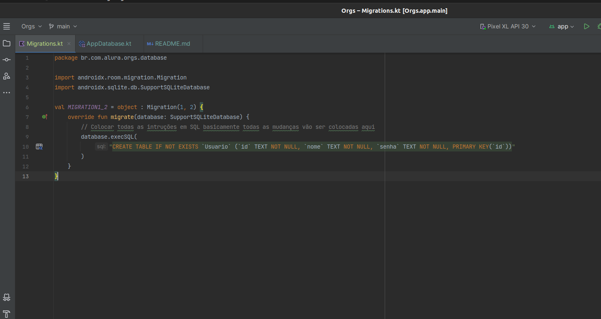

# Kotlin Migrations

A migration ja ocorre de _**maneira automatica_** em alguns casos em novas versões do ROOM (*
*_olhar a
documentação_**) porém dentro desse projeto poderemos trabalhar primeiro de maneira manual para que
possamos tratar quando pegarmos um **projeto legado** no qual não poderemos atualizar a lib.

## Visão Geral

O Room é uma biblioteca de persistência de dados recomendada pelo Google para aplicativos Android.
Ele oferece suporte à criação e gerenciamento de bancos de dados SQLite de forma mais fácil e
eficiente.

**_Link para a documentação Android Envolvendo o migrations_
**:https://developer.android.com/training/data-storage/room/migrating-db-versions#test

### Migrations:

A cada mudança No nosso room, ou seja, a cada adição de uma entidade ou algo assim precisamos mudar
a versão do nosso room, por padrão ele vem como versão = 1.

### O método fallbackToDestructiveMigration():

Este código usa fallbackToDestructiveMigration() ao construir o banco de dados usando o
Room.databaseBuilder(). Aqui está uma explicação da chamada de migrações nesta parte do código:

O método fallbackToDestructiveMigration() é chamado para configurar o Room para permitir migrações
destrutivas. Isso significa que se houver uma alteração no esquema do banco de dados que não seja
compatível com a versão anterior, o Room irá descartar todo o banco de dados e recriá-lo do zero.
Isso é útil durante o desenvolvimento, mas não é recomendado para produção, pois leva à perda de
dados.

**É importante notar que esse método não requer parâmetros. Ele simplesmente indica ao Room que
migrações destrutivas são permitidas.**

### .addMigrations ( )

No Room, o método addMigrations() é usado para aplicar migrações personalizadas ao banco de dados
SQLite quando há uma alteração no esquema do banco de dados que não pode ser tratada pela migração
destrutiva.

Criamos um Arquivo de dentro de **_datababe_** para poder colocar um file Migrations onde iremos
colocar todas as nossas migrations dentro do projeto.

É uma prática recomendada criar uma classe separada, geralmente chamada Migration, onde você
implementa as migrações necessárias para cada versão do banco de dados. Isso ajuda a manter o código
limpo e organizado.

### Preferences 

Salvar dados primitivios a partir de chave e valor

- SharedPreferences: Api do android no qual temos acesso em todas aplicação
- vem do SDK do android
- Solução antiga, Nova solução é o 

### DataStore

Documentação: 

O DataStore é uma solução de armazenamento de dados recomendada pela Google para aplicativos
Android. Ele oferece uma maneira fácil e segura de armazenar dados chave-valor ou objetos complexos
de forma assíncrona, substituindo o SharedPreferences. O DataStore utiliza os princípios de Kotlin
coroutines e permite que você armazene e recupere dados de forma eficiente, mantendo a consistência
e a integridade dos dados. Além disso, o DataStore oferece suporte a observação de mudanças nos
dados, facilitando a atualização da interface do usuário quando os dados são alterados. É uma
alternativa moderna e robusta para persistência de dados em aplicativos Android.

Basicamente quando queremos deixar o usuario logado ao app quando entramos novamente em algum app.
Por exemplo: Quando entramos ao instagram, ja estamos logados todas as vezes nas quais entramos la.

- Proto DataStore salva **protocol buffer** tbm. Estudar mais sobre isso!

### Comportamento Do app: 

- Funcionalidade de deixar o usuário sempre logado assim que ele logou a primeira vez.
  - Mudar qual a tela que inicia ao inserir o app
  - No caso, como o usuário ja realizou o login, não precisamos ficar  mostrar a tela de login toda 
que ele for iniciado

- Suporte para o usuário ter a escolha de sair do app e logar com outro usuário
