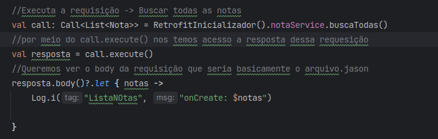
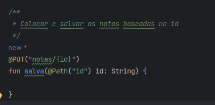

# Web API

- Este projeto simula o google keep: adicionar, remover e editar uma nota por meio de uma api.
- Como o room apenas deixa salvo no bd local do device, quando precisamos guardar informações
  indenpendete do device que estamos utilizando.

## Intent

No contexto de desenvolvimento Android, "extras" são dados adicionais que podem ser anexados a uma
Intent para transmitir informações entre diferentes componentes da aplicação, como atividades (
Activities) ou serviços (Services).

- **Intent**: Um objeto Intent pode ser usado para iniciar uma nova atividade ou serviço, ou para
  transmitir uma mensagem para um BroadcastReceiver.
- **Extras**: São pares chave-valor que podem ser anexados à Intent. Eles são usados para passar
  dados
  adicionais que a atividade ou serviço de destino pode precisar.

### Comunicação com WEB api

- **Web API**: Comunicação entre uma interface, porem web. Uma lib ou qualquer coisa nesse sentido
  Serviços online, comunicação entre esses serviços online.
- Garantir que os dados fique acessiveis
- Trafegar dados em diferentes dispositvos
  

### Rest

- Trasnferencia Representacional de Estado
- Padrão para fazer essa comunicação entre os dispositivos
- Formato Jason

**Outras APIS públicas** https://github.com/public-apis/public-apis

### API

- A API utilizada nesse projeto eh uma local desenvolvida em Spring Boot
- Como rodar a api:
    - a partir de um terminal ou prompt de comando, acesse o diretório/pasta onde o arquivo
      server.jar está e rode o seguinte comando java -jar server.jar.
    - acessando o endereço http://localhost:8080

### Retrofit

Lib no qual a comunidade usa para fazer requisições web

- **Serialização automatica para corpos** de serialização do corpo de uma requisição
- Existem outras libs como:z
    - Ktor
    - Volley (google)
      porem o que a comunidade realmente usa **seria o retrofit mesmo**!

### Permissão de acesso a internet

No android manifest:
<uses-permission android:name="android.permission.INTERNET" />

### Convertando formato da requisição:

Se chamarmos assim, o app irá quebrar pois ele sempre vai dar um erro no qual **teremos que
converter o tipo do jason para algum objeto reoconhecido pelo java/kotlin**(o que ainda não fazemos)

UsesClearTextTRaffic: não usar no dia a dia apenas para fins didaticos -> usar o https

### call.execute() != call.enqueue

- call.execute() : **Chamada é feita de forma Sincronca**.Trava a nossa thread principal, temos que
  criar courotines o que não faz isso da melhor forma possivel, por isso nas implementações passadas
  utilizamos dentro de lifecycle.launch(IO) para não bloquear a ui.
- call.enqueue() :  **A chamada é assíncrona**, ou seja, não bloqueia a thread na qual é executada.
  A
  requisição é feita em segundo plano e os callbacks são chamados quando a resposta é recebida ou
  ocorre um erro.
- Usaremos a abordagem de courotines do retrofit

### Repository

- Para tirarmos informações da UI utilzamos o repopository para fazer o meio de campo na comunicação
  entre a UI e os services de WEB e de DB. A Activity se comunica com o Repository que irá se
  comunicar com o Web Client ou o Banco de Dados.

### UUID

- Link : https://en.wikipedia.org/wiki/Universally_unique_identifier

### Anotações do Retrofit:

- No exemplo de código:
  
- @PUT(): Anotação que é responsavel pela requisições http da lib Retrofit
- "notas/{id}" é a URL para a qual a requisição será enviada. {id} é um placeholder que será
  substituído pelo valor do id fornecido na chamada da função.
- O **HTTP PUT** é usado para mandar dados do lado do servidor para quando queremos **_atualizar uma
  informação ja existente_**

### Flags de Sincronização:

- Caso que inserimos algum lembrete sem acesso a internet ? teria que salvar no Banco e depois
  mandar para api.
    - Alguma outra forma de não conseguir se conectar com a api.

- Com isso, fazemos uma **_flags_** para saber se alguma nota/registro para saber se foi ou não
  sincronizado
    - Assim o usuário pode colocar o que desejar no app e com as condições favoraveis(acesso a
      internet) ele faz o envio para a API